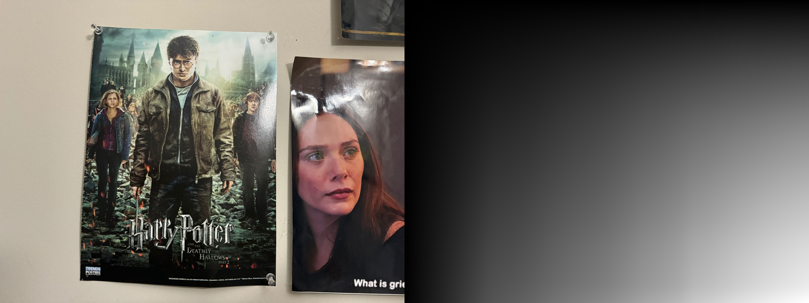

# CSc 8830: Computer Vision : Assignment 2 Solutions

## Question 1

The solution can be found in the the file 'q1.ipynb'

The code prompts the user to take a 10 seconds video. The video frames are stored in the folder "video_frames".

A random image was chosen from the video frames to perform CANNY EDGE DETECTION and stored in canny_edge_detection.png.

___

## Question 2

Similar to Question 1, The Harris corner detection algorithm was manually applied to a 5x5 image patch within a selected region containing a corner of interest. 

The detected corner pixels were noted and compared with automated implementations using DepthAI's Harris corner detection function for a comprehensive analysis.

The solution can be found in the the file 'q2.ipynb'

___

## Question 3

The SIFT feature extraction and matching algorithm was implemented to compute the sum of squared differences (SSD) between corresponding super-pixel patches in two images from the 'video_frames' separated by at least 2 seconds with some scene overlap.

The Homography matrix was also computed between these images, along with its inverse, using Python implementation.

The solution can be found in the the file 'q3.ipynb'

___

## Question 4

The code computes and displays the integral image feed alongside the RGB feed without relying on built-in functions such as "output = integral_image(input)".

The implementation initializes the integral image to zero, copies pixel values from the grayscale image, and calculates the integral image using the integral image algorithm.

### Integral Image Matrix
[Integral Image Matrix File](integral_matrix.txt)

### Integral Image Display for Frame.jpg

___

## Question 5

The image stitching functionality for creating a 360-degree panoramic output in real-time was successfully implemented, utilizing SIFT or ORB features. 

The implementation involved constructing panoramas from images of home and science buildings without utilizing built-in functions directly performing image stitching.

Below are the images of Home Buildings used: 
<table>
  <tr>
    <td></td>
    <td></td>
    <td></td>
  </tr>
</table>

### Home Buildings SIFT Stitching : 

### Home Buildings ORB Stitching, other buildings : 

### Home Buildings SIFT Stitching : Panaroma : 

___

## Question 6

Integrated the applications developed for problems 4 and 5 with the web application.

[Demo Video Link](https://youtu.be/lAeOesuI-IY)

## Home Page : 

# Problem 4 Solution : 

# Problem 5 Solution : 

