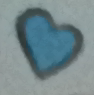

# CSc 8830: Computer Vision : Assignment 3 Solutions

## Question 1

The code prompts the user to take a 10 seconds video. The video frames are stored in the folder "video_frames".

From this footage, one image frame is selected. A region of interest (ROI) corresponding to an object in the selected frame is cropped. 

This cropped region is then used to compare with randomly selected frames from the dataset of 10-second video frames to check for a match of the object in the scenes from these frames.

For comparison, the sum of squared differences (SSD) or normalized correlation is used.

This comparison helps in identifying whether the object present in the cropped region appears in any of the randomly selected frames from the video dataset. This process enables assessing the presence and similarity of the object across different scenes within the video footage.

## ROI :

# Few matched images using SDD and Normalized Correlation
| Image 1 | Image 2 | Image 3 | Image 4 |
|---------|---------|---------|---------|
|  |  |  |  |

___

## Question 2

Derived the motion tracking equation from fundamental principles and implemented the Lucas-Kanade algorithm for affine motion. 

This involved understanding the theoretical foundations of motion tracking and optical flow estimation, as well as applying the Lucas-Kanade algorithm to estimate motion parameters in scenarios where motion follows an affine transformation. 

[Q2 PDF](q2.pdf)
___

## Question 3

Utilized stereo vision theory to estimate the distance D(in the case D = 65.5 mm) to a marker from a stereo camera setup. Captured two images (m1.jpg and m2.jpg) of a marker from a stereo camera setup.

Achieved  to estimate the distance to a marker from a stereo camera setup by computing the disparity map and converting it into a depth map. 

The solution is in [q3](q3/q3.ipynb) and the respective images are also available in the same file.

___

## Question 4

successfully plotted optical flow vectors on each frame of the video using MATLAB's optical flow codes, considering three different reference frame strategies: treating every previous frame, every 11th frame, and every 31st frame as a reference.

The solution is in [q4](q4/q4.ipynb)

## Every Previous Frame

| Optical Flow Image | Optical Flow Mask |
|--------------------|-------------------|
|  |  |

## Every 11th Frame

| Optical Flow Image | Optical Flow Mask |
|--------------------|-------------------|
| |  |

## Every 31st Frame

| Optical Flow Image | Optical Flow Mask |
|--------------------|-------------------|
| |  |

___

## Question 5

# Feature-Based Object Detection with OAK Camera

Template matching techniques are employed to detect objects of interest within the scene, outlined by rectangles for visualization.

The solution is in [q5](q5/q5.ipynb)

The pattern searched here were the blue heart and the purple star. The original image alone with the cropped pattern to search I used is given below.

| Blue Heart | Purple Star |
|--------------------|-------------------|
| |  |

# Findings 

___

## Question 6

# Bag of Features

For this evaluation, I chose an object category commonly seen in households, namely 'cutlery', and selected five object types: spoon, fork, knife, chopstick, and scissor. 

The evaluation involved assessing the accuracy and effectiveness of the Bag of Features approach in classifying these object types, providing insights into its performance in household object recognition tasks."

The solution is in [q6](q6/q6.mlx)

___

## Question 7

The rotation angle was noted down during the experiment. 

Executed the provided MATLAB tutorial for uncalibrated stereo image rectification using the captured image pairs. Assumptions made during the experiment have been justified in the description provided.

The solution is in [q7](q7/q7.mlx)

  
   

___

## Question 8

The first version utilizes a marker, such as QR code or April tags, to track objects, while the second version relies solely on the object itself without the use of any marker.

Both versions demonstrate the ability to track objects in real-time, providing versatile solutions for object tracking tasks.

The solution is in [q8](q8/q8.py)

| Detected Frame (Marker) | Detected QR Code (Marker) | Tracked Object (No Marker) |
|--------------------------|-----------------------------|----------------------------|
|  |  |  |

