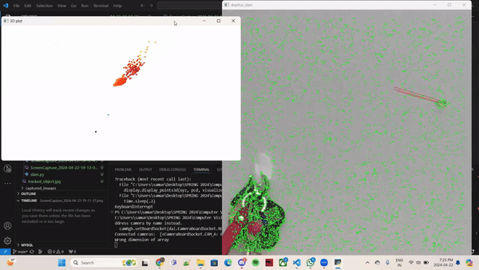

# CSc 8830: Computer Vision : Assignment 4 Solutions

## Question 1

Developed an application that utilizes a stereo camera to recognize, track, and estimate the dimensions of objects within a 3-meter distance and inside the camera's field of view. 

The application achieves this without using machine learning or deep learning tools. Instead, it employs computer vision techniques such as object detection, tracking, and dimension estimation.

Overall, the application provides a robust solution for object tracking and dimension estimation using stereo camera technology, without relying on machine learning or deep learning algorithms.

  <h2>Application Demonstration</h2>
  

___

## Question 2

The solution can be found in q2 folder. You can run the solution using 'main.py'

Some limitations and corner cases that were observed when using the DepthAI SDK - ORB-SLAM3:

1. **Limited Lighting Conditions**: Both DepthAI SDK and ORB-SLAM3 may struggle in low-light or highly variable lighting conditions. This can lead to inaccurate depth estimation and feature tracking, resulting in drift or loss of tracking.

2. **Textureless Surfaces**: Surfaces without sufficient texture or distinctive features can pose challenges for both systems. The SLAM algorithms may fail to accurately estimate the camera pose.

3. **Dynamic Environments**: Moving objects can be mistakenly treated as static features, causing inconsistencies in the mapping and localization.

4. **Large Camera Movements**: Rapid or large camera movements can cause motion blur and disrupt feature tracking. This can lead to inaccurate pose estimation and affect the overall mapping quality.

5. **Computational Resources**: SLAM algorithms can be computationally intensive, especially when processing high-resolution images or running in real-time on embedded devices. Limited computational resources may lead to reduced performance or slower mapping and localization.

Here are few examples while working with the application in different environments. Rest of the screencaptures and screenshots are in the q2 folder.

| Environment 1 | Environment 2 |
|---------------|---------------|
|  |  |

 Environment 3 | Environment 4 |
|---------------|---------------|
|  |  |
