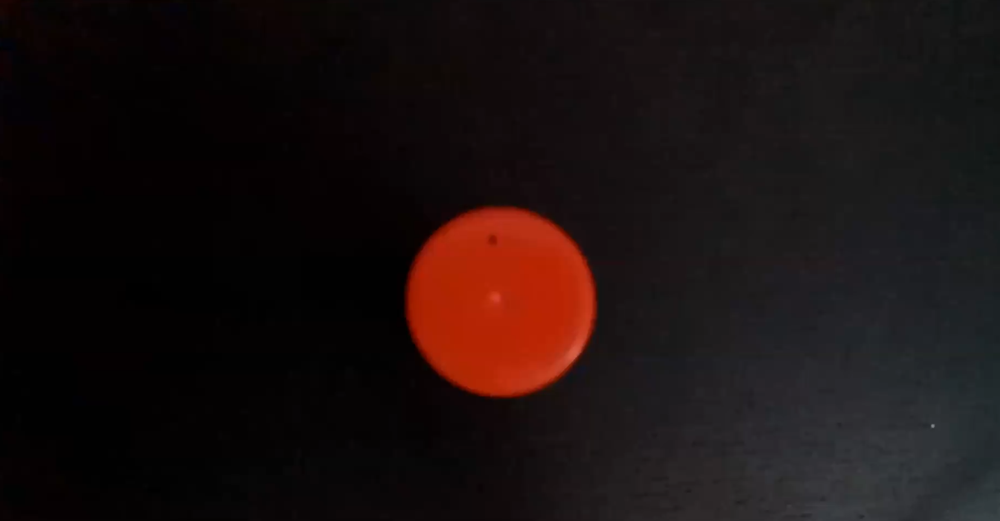
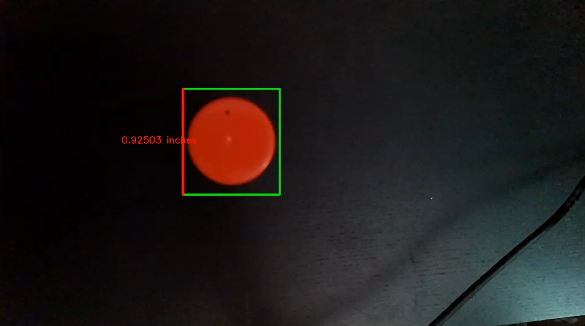

# CSc 8830: Computer Vision : Assignment 1 Solutions

## Question 1

To calibrate the camera, I have used a 8x6 checkerboard pattern. 

The code to take 10 images of the checker board using both the monochrome (left and right) and color cameras can be found in the file ques1.ipynb
The images captured can found in the folder 'images'.

The images are then used for calculating the camera matrix, translation and rotational vectors.

The corrected images are found in the 'images' folder and the corresponding camera values are stored in their respective folders (left, right and color).

<table>
  <tr>
    <td></td>
    <td></td>
    <td></td>
  </tr>
</table>

___

## Question 2

Used the camera matrix, rotational matrix, and translation matrix (previously derived in Question 1) to convert image coordinates to world coordinates.

Distance Measurement in 3D Space:
Selected two pixel coordinates from an image, converted them into world coordinates using the transformation matrices, and calculated the distance between these 3D points, determining the real-world distance.

Successfully computed the rotation matrix from the extrinsic parameters and subsequently calculated the rotation angles along each axis, choosing the order of rotation based on the experimentation setup and requirements.

___

## Question 3

I designed and implemented a script utilizing perspective projection equations to determine the real-world dimensions, in this case a circular object. 

To validate the accuracy of the calculations, I conducted an experiment where I imaged an object using a camera from a specific distance, ensuring precise measurement capabilities for accurate results.

___

## Question 4

[Video Link](https://youtu.be/C7gIupU_YD0)

I developed a web application that functions as a platform-independent solution for computing real-world dimensions of objects in view. 

The application can run directly in a web browser, ensuring compatibility across different operating systems. 

To facilitate ease of use, the application makes justifiable assumptions, such as allowing users to identify points of interest on the object by clicking s and then cropping the image.

| App Capture Page                          | App Result Page                          |
|-------------------------------------------|------------------------------------------|
|  |  |

### Example of Application Working

| Object Image                               | Annotated Image                                |
|--------------------------------------------|------------------------------------------------|
|  |  |

